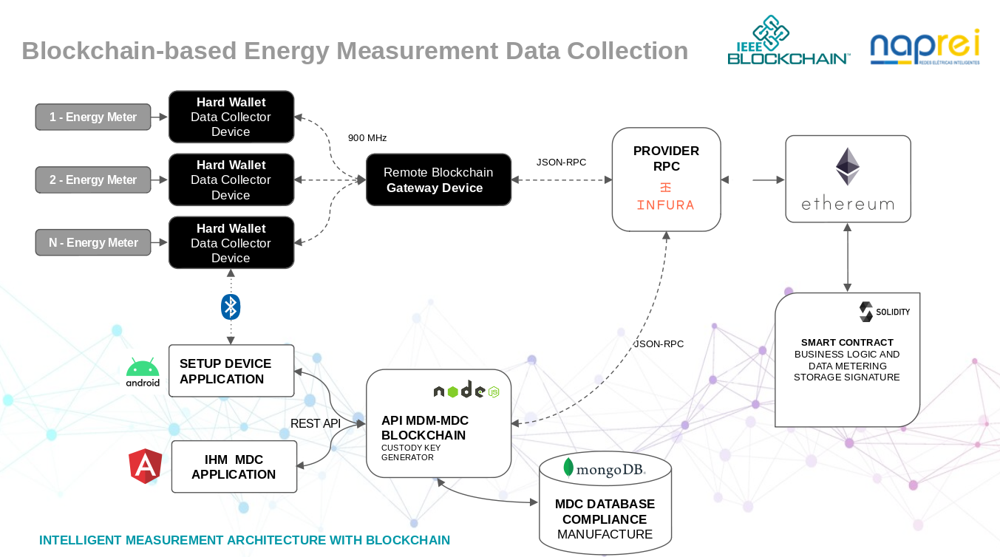
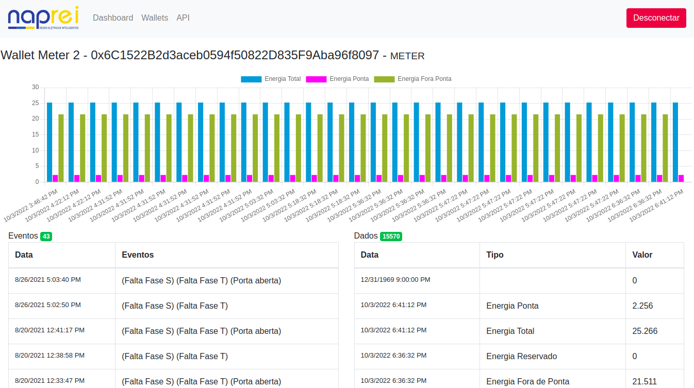

# ENERQ IEEE BCTE

Contract Test Ropsten - 0x786022278E64838A505e33c88697b200d331D5C8
[Contract POC](https://ropsten.etherscan.io/address/0x786022278e64838a505e33c88697b200d331d5c8)

Open Contract Free Used Goerli - 0xb7C138B2559C1E3019dA094eB5d19cbAE9caB5aC
[Open Contract](https://goerli.etherscan.io/address/0xb7C138B2559C1E3019dA094eB5d19cbAE9caB5aC)

ABI
[Open Contract ABI](contract/ABI-JSON.json)

### IEEE BCTE Demonstration Project

Blockchain-based Energy Measurement Data Collection

### Reference Links

[Demo Application](http://www.naprei.prp.usp.br:3000)

[Presentation](docs/PRESENTATION.pdf)

[Data Protocol](docs/PROTOCOL.pdf)

[Project evolution page and documents](https://app-enerq-ieee-btce.vercel.app/)

### Apresentation

### Authors

Dr. Luiz Henrique Leite Rosa
luizhenrique.rosa@alumni.usp.br

Mr. Marcio Ribeiro Cruz
marciorcruz@gmail.com